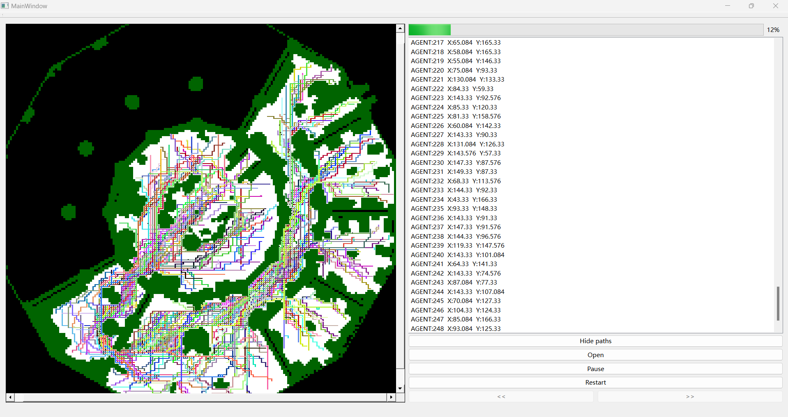

# Continuous-MAPF_visualizer
A Qt frame work continuous mapf visualizer. 
Using Qt4.6.1, C++17.  
Demo :  
  
construct and run  
load your xml file  
Basic frame comes from one issue in [CCBS](https://github.com/PathPlanning/Continuous-CBS)  
Add some features